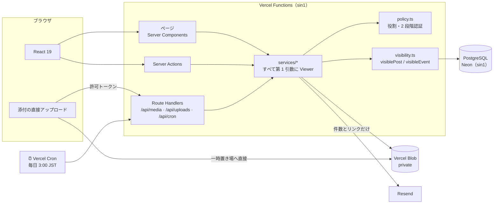
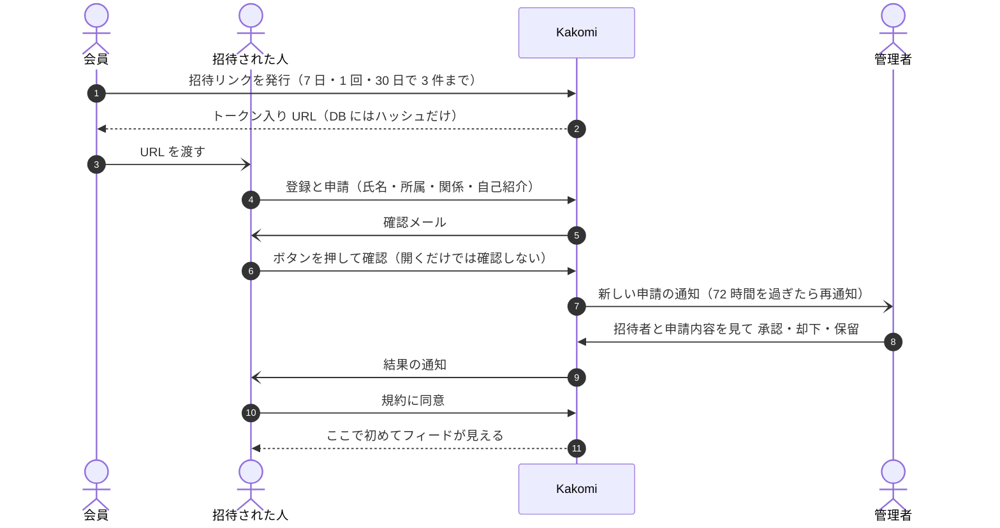
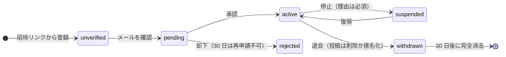
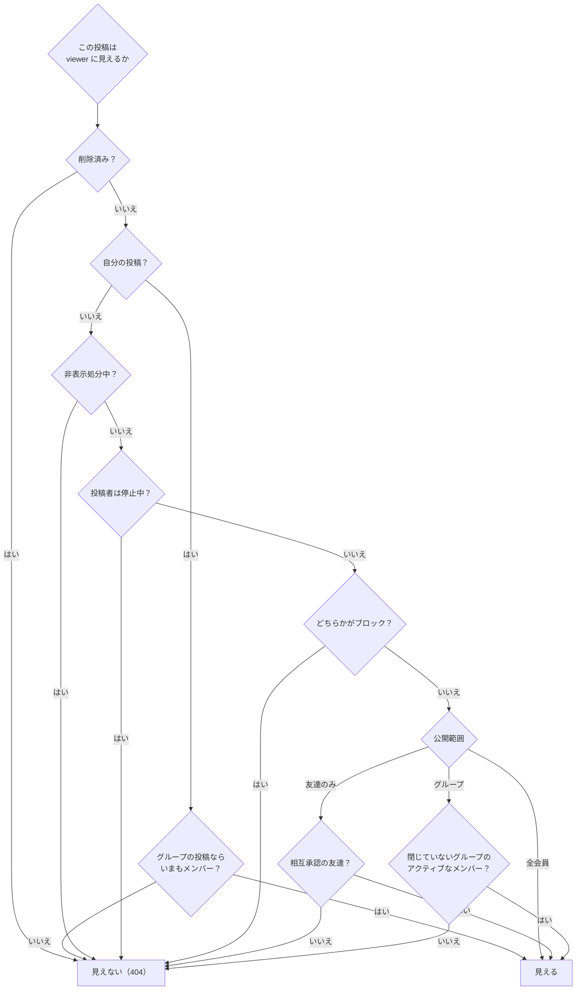
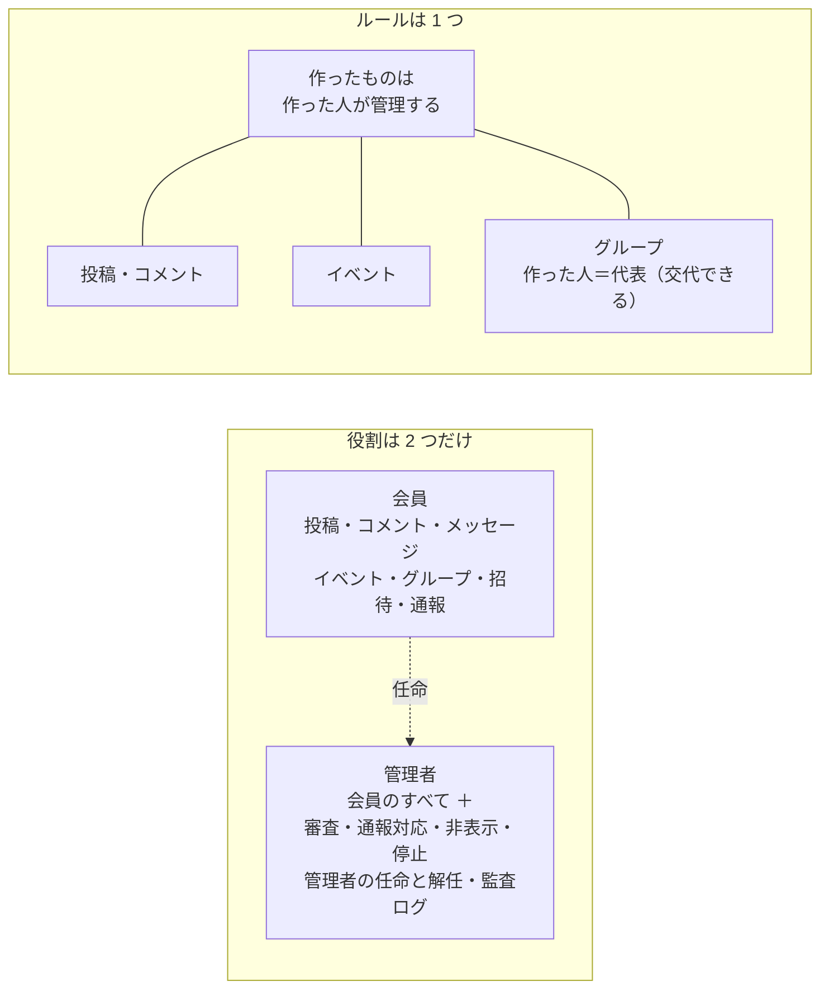
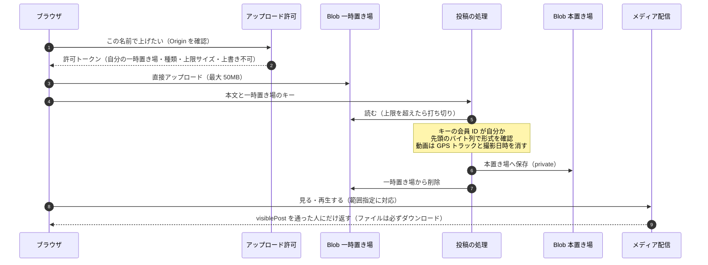
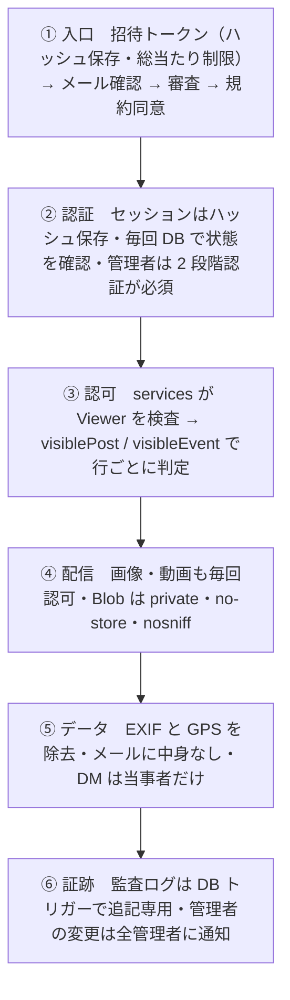
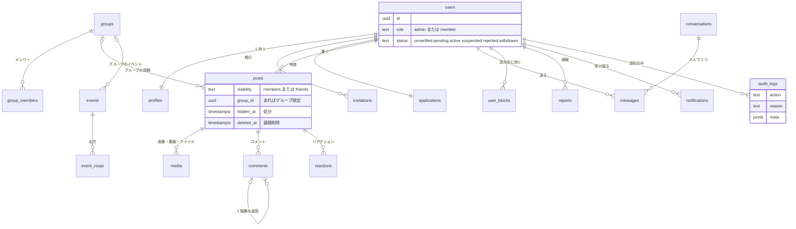
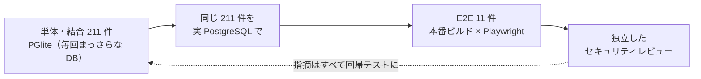
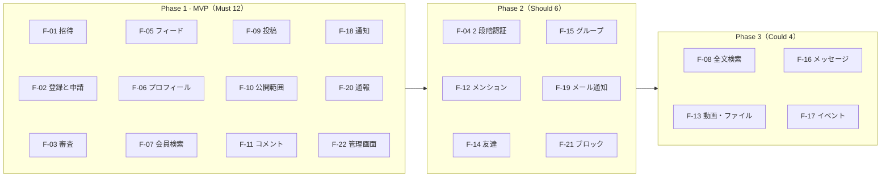

<div align="center">

# Kakomi

**招待され、承認された人だけが入れる。外からは何ひとつ見えない SNS。**

Facebook の「フィード・投稿・コメント・グループ・イベント・メッセージ」を、<br>
*許可制* を前提にゼロから設計し直したクローズド SNS です。


[すぐ試す](#すぐ試す) · [アーキテクチャ](#アーキテクチャ) · [見える範囲の設計](#見える範囲はsql-の条件式ひとつ) · [多層防御](#多層防御) · [テスト](#テスト) · [設計記録（ADR）](docs/adr)

</div>

---

## ひとことで

> **「見えてはいけない人に、見えてしまうこと」を、仕組みで起こせなくした SNS。**

公開 SNS で起きる荒らし・なりすまし・情報漏えいを **入口で断ち**、中に入った後も **誰が何を見られるかを 1 か所の SQL で決める**。
その上で、フィード・グループ・イベント・1 対 1 メッセージ・動画とファイル・全文検索まで、要件定義書の **Must / Should / Could の全 22 機能** を実装しています。

| | |
| --- | --- |
| **入口は 1 本** | 招待リンク → メール確認 → 管理者の審査 → 規約同意。一般公開の登録口はない |
| **見える範囲は SQL ひとつ** | `visiblePost` をフィード・詳細・画像・通知・検索・メンションの **全経路** が通る |
| **消せない監査ログ** | DB トリガーで追記専用。管理者でもアプリのバグでも書き換えられない |
| **位置情報を残さない** | 画像は再エンコードで EXIF ごと、動画は GPS トラックと撮影日時まで消す |
| **メールに中身を書かない** | 通知メールは件数とリンクだけ。本文も人の名前も外へ出さない |
| **管理者も DM を読めない** | 1 対 1 メッセージは当事者 2 人だけ |

### 数字で見る

| 22 | 31 | 15 | 211 | 11 | 46 |
| :---: | :---: | :---: | :---: | :---: | :---: |
| **機能**<br>Must・Should・Could すべて | **テーブル**<br>すべて Drizzle で型付き | **マイグレーション**<br>すべて「足すだけ」 | **単体・結合テスト**<br>PGlite と実 PostgreSQL の両方 | **E2E**<br>本番ビルドをブラウザで | **セキュリティ指摘を修正**<br>フェーズごとの独立レビュー |

---

## すぐ試す

Node.js 20.9 以上だけで動きます。**DB はアプリに組み込まれた PostgreSQL（PGlite）** なので、Docker も DB サーバーもいりません。

```bash
npm install
npm run demo      # DB 作成 ＋ デモの会員・投稿・グループ・イベント・メッセージ・通報を投入
npm run dev       # http://localhost:3000
```

ログイン画面の **「デモアカウント」から 1 クリック** で入れます（ローカルの PGlite で開発しているときだけ有効。production ビルド・Vercel・`DATABASE_URL`・https のどれかがあれば、画面にも出ず使えません）。

<details>
<summary><b>デモアカウント 12 人</b>（権限 × 状態の組み合わせを網羅）</summary>

パスワードはすべて `demo-password-123`。2 段階認証が有効な人は、認証アプリに鍵 `KAKOMIDEMOKAKOMIDEMOKAKOMIDEMO23` を登録するとコードが出ます（デモ専用）。

| 区分 | メール | 状態 | 試せること |
| --- | --- | --- | --- |
| 管理者 | owner@example.com | 2 段階認証 有効 | 最初の管理者。すべての管理機能、管理者の任命・解任 |
| 管理者 | admin@example.com | 2 段階認証 有効 | 入会審査（72 時間超過の申請あり）、通報対応、監査ログ |
| 管理者 | admin-new@example.com | 2 段階認証 未設定 | 管理画面に入れず、設定へ案内される（`npm run mfa:ticket -- admin-new@example.com`） |
| 会員 | sato@example.com | — | 投稿・画像・招待、山歩きの会の代表、田中さんとのメッセージ |
| 会員 | tanaka@example.com | — | 「友達のみ」の投稿者、読書会の代表 |
| 会員 | suzuki@example.com | — | 「友達のみ」が見えない側。通報された投稿の投稿者 |
| 会員 | takahashi@example.com | 2 段階認証 有効 | 任意の 2 段階認証、リカバリーコード |
| 会員 | ito@example.com | 規約 未同意 | 同意するまで中身が見えない |
| 申請者 | yamada@example.com | 審査待ち | 申請状況だけが見える |
| 申請者 | kobayashi@example.com | メール確認待ち | 確認メールの再送 |
| 入れない人 | nakamura@example.com | 利用停止 | ログインを拒否される |
| 入れない人 | watanabe@example.com | 却下 | ログインを拒否される |

`npm run demo` は何度流しても大丈夫です（足りない分だけ足します）。送ったメールは http://localhost:3000/dev/mail で読めます。

</details>

---

## アーキテクチャ



**原則は 3 つだけです。**

1. **認可はサービス層の 1 か所**：画面・Server Actions・Route Handlers は `services/*` を呼ぶだけ。Server Actions は外から直接叩ける HTTP エンドポイントなので、画面側のチェックには頼りません。
2. **状態は毎リクエスト DB から読む**：停止・退会・ブロックは、次のクリックから即座に効きます。
3. **判断は ADR に残す**：[0001 構成](docs/adr/0001-architecture.md) · [0002 2 段階認証](docs/adr/0002-two-factor-auth.md) · [0003 Phase 2](docs/adr/0003-phase2.md) · [0004 Phase 3](docs/adr/0004-phase3.md) · [0005 役割の単純化](docs/adr/0005-simple-roles.md)

---

## 入口は 1 本だけ





> 中身が見えるのは **`active` かつ規約に同意済み** の人だけです。ほかの状態では、URL を直接開いても何も返しません。

---

## 見える範囲は、SQL の条件式ひとつ

このプロダクトでいちばん大事な関数が、[`src/server/lib/visibility.ts`](src/server/lib/visibility.ts) の `visiblePost` です。
**フィード・投稿詳細・プロフィール・コメント・リアクション・通報・画像と動画の配信・通知・メンション・タグ・検索** のすべてが、この 1 つの条件式を通ります。
だから「一覧では見えないのに、画像の URL を直接開くと見える」というズレが、構造上起きません。



イベントも同じ考え方の `visibleEvent`、コメントは「親投稿が見えること」を前提にした `visibleComment` です。
見えないものは **「存在しない」のと同じ応答（404・「見つかりません」）** を返し、ブロックや非公開の投稿の存在そのものを推測させません。

---

## 役割は 2 つ、ルールは 1 つ



- **管理者どうしは対等**。任命・解任・停止は **ほかの管理者全員に通知** され、監査ログに残ります。見える化で権限の独占を防ぎます。
- **自分自身は処分できない**。**最後の 1 人の管理者は解任・停止・退会できない**（同時に停止し合っても 0 人にならないよう、DB のロックで 1 件ずつ処理）。
- 管理者の権限は **2 段階認証を設定するまで 1 つも働きません**。設定には運営者の 1 回限りのチケットが要ります（[ADR 0002](docs/adr/0002-two-factor-auth.md)）。

---

## 大きなファイルは、アプリを通さずに上げる

Vercel Functions のリクエスト本文は **4.5MB まで**。そこで画像はブラウザで縮めてから送り、動画とファイルはブラウザから **Blob の一時置き場へ直接** 上げます。
投稿するときにサーバーが **持ち主・大きさ・中身** を確かめ、動画のメタデータを消してから本置き場に移します。



<details>
<summary><b>動画の位置情報をどう消しているか</b></summary>

撮影場所は、MP4 の中の 2 か所に入ります。

| 入る場所 | 例 | 消し方 |
| --- | --- | --- |
| メタデータの箱 | `moov/udta/©xyz`、`moov/meta`（iPhone） | 箱の種類を `free` にして中身をゼロで塗る |
| 時系列のトラック | GoPro の GPMF、ドローンの位置字幕、Apple の `mebx` | `stbl`（`stsz` / `stsc` / `stco`）からサンプルの位置を求め、**`mdat` の中身ごと** ゼロで塗る |
| 撮影日時 | `mvhd` / `tkhd` / `mdhd` | 作成・更新日時を 0 に |

箱の大きさと位置を変えないので、再生に必要なオフセットは壊れません。確実に消せない形式（fragmented MP4 など）は受け付けません。実装は [`src/server/lib/mp4.ts`](src/server/lib/mp4.ts)。

</details>

---

## 多層防御



| 脅威 | 対策 |
| --- | --- |
| 検索エンジン・OGP からの漏えい | 全レスポンスに `X-Robots-Tag: noindex`、`robots.txt` で全面禁止、OGP に本文を出さない |
| 画像 URL の直打ち | Blob は private。必ず `/api/media` の認可を通し、見えなければ 404 |
| ファイルを装った攻撃 | 拡張子と Content-Type を信用せず、中身で判定。HTML・SVG は受け付けず、ファイルは必ずダウンロード |
| アカウントの存在確認 | 登録済みのメールでも画面の応答は同じ。本人にだけメールで知らせる |
| 総当たり | ログイン・招待・パスワード再設定・2 段階認証・検索・アップロードに回数制限 |
| DB の漏えい | 招待・セッション・確認のトークンはハッシュだけ。2 段階認証の鍵は DB と別の鍵で暗号化 |
| 権限の乱用 | 監査ログは消せない。管理者に関わる変更は全管理者に通知 |

フェーズごとに **独立したエージェントによるセキュリティレビュー** を受け、指摘（MVP 12・2 段階認証 5・リリース機能 4・Phase 2 14・Phase 3 11）をすべて直して回帰テストにしています。

---

## データモデル（主なもの）



---

## テスト



E2E は 1 本の物語として、許可制 SNS の流れを最初から最後まで通します。

`未ログインでは何も見えない` → `管理者も 2 段階認証まで管理画面に入れない` → `招待 → 登録 → メール確認` → `審査中は中身に触れない` → `承認 → 規約同意 → フィード` → `友達のみ・メンション・通知` → `検索・メッセージ・イベント・ファイル添付` → `承認制グループ` → `パスワード再設定` → `停止で即座に締め出し`

```bash
npm run typecheck
npm test                                                     # 単体・結合 211 件（PGlite）
DATABASE_URL=postgres://... PGLITE_DIR= npm run db:migrate   # 空の UTF8 の DB に
TEST_DATABASE_URL=postgres://... npm run test:pg             # 同じテストを実 PostgreSQL で
npm run build && npm run test:e2e                            # E2E 11 件
npm run verify                                               # 上記すべて
```

> 実 PostgreSQL の DB は UTF8 で作ってください（検索が `normalize()` を使います。Neon は常に UTF8。手元なら `initdb -E UTF8`）。

---

## 本番（Vercel）

本番は https://kakomi.vercel.app（Vercel `brightbroom-projects/kakomi`）。**アプリ・DB・Blob をすべてシンガポール（sin1）に置き**、往復の遅延をなくしています。

| 役割 | サービス | 備考 |
| --- | --- | --- |
| アプリ | Vercel Functions（sin1） | `vercel.json` でリージョンを固定。ビルド時にマイグレーション |
| DB | Neon（sin1） | `DATABASE_URL`（プーラー）と `DATABASE_URL_UNPOOLED`（マイグレーション用） |
| ファイル | Vercel Blob（private・sin1） | 直接の URL では読めない |
| メール | Resend | 件数とリンクだけ |
| 定期処理 | Vercel Cron | 毎日 3:00（日本時間） |

```bash
vercel deploy --prod
```

<details>
<summary><b>環境変数</b></summary>

| 環境変数 | 内容 |
| --- | --- |
| `MFA_ENCRYPTION_KEY` | **必須**。2 段階認証の鍵を暗号化する鍵（`openssl rand -base64 32`）。失うと全員の 2 段階認証が使えなくなる。DB と別の場所に控える |
| `CRON_SECRET` | **必須**。毎日の定期処理の鍵。未設定だと定期処理は動かない |
| `OPERATOR_NAME` / `CONTACT_EMAIL` | **必須**。利用規約・プライバシーポリシーに出す運営者名と問い合わせ先 |
| `RESEND_API_KEY` / `MAIL_FROM` | メール送信。設定したら `EMAIL_VERIFICATION` を削除して再デプロイ |
| `EMAIL_VERIFICATION` | `off` の間はメール確認を省く（招待＋審査だけで入会） |
| `APP_URL` | 独自ドメインのときだけ。未設定なら Vercel の本番ドメイン |

設定の漏れは、管理画面のダッシュボード下部 **「リリース前チェック」** で確かめられます。

</details>

<details>
<summary><b>運用：定期処理・2 段階認証・最初の管理者</b></summary>

**毎日の定期処理**（`npm run maintenance` で手元からも流せます）

- 週次アクティブ率を 1 日 1 行記録（Phase を進める判断に使う。人数だけを持つ）
- 削除から 30 日たった投稿を完全に消す／退会から 30 日たった人の個人情報を消す
- 72 時間を超えて審査待ちの申請を、管理者に再通知
- 上げたまま投稿されなかった添付、期限切れのセッション・トークンを片付ける
- 通知メールの送り直しと、週 1 回のまとめ（月曜）

**2 段階認証**（管理者は必須。設定には運営者の 1 回限りのチケットが要る）

```bash
set -a; source .env.production.local; set +a
npm run mfa:ticket -- someone@example.com                      # 設定チケット（本人に画面の外で渡す）
npm run mfa:reset -- someone@example.com "解除の理由と本人確認"  # 端末を失ったとき（監査ログに残る）
```

**最初の管理者**（会員が 0 人のときだけ作成。環境変数の名前は互換のため `OWNER_*`）

```bash
vercel env pull .env.production.local --environment production
set -a; source .env.production.local; set +a
OWNER_EMAIL=... OWNER_PASSWORD=... npx tsx --conditions=react-server scripts/seed.ts
```

Vercel 以外で動かすときは `DATABASE_URL` を設定し、ファイルはディスク（`UPLOAD_DIR`、永続ボリューム）に保存します。リバースプロキシの後ろなら `TRUST_PROXY=1`。

</details>

---

## 要件定義書との対応

[要件定義書](docs/requirements.md) の **Must 12・Should 6・Could 4 の全 22 機能** を実装しています。



<details>
<summary><b>機能ごとの実装メモ</b></summary>

| ID | 機能 | 実装メモ |
| --- | --- | --- |
| F-01 | 招待リンク | 会員は 30 日で 3 件、管理者は無制限。回数・期限を指定、即時失効、招待の系譜 |
| F-02 | 登録と申請 | 1 画面に統合。メールの確認はボタン押下（リンク検査ボット対策） |
| F-03 | 審査 | 承認／却下（理由テンプレート）／保留、招待者の表示、72 時間超過の強調 |
| F-04 | 2 段階認証 | TOTP ＋ リカバリーコード。管理者は必須、会員は任意 |
| F-05 | フィード | 新着順・20 件ずつ。ミュートした人は外す |
| F-06 | プロフィール | 写真・自己紹介・所属・投稿一覧 |
| F-07 | 会員検索 | 名前・所属 |
| F-08 | 全文検索 | 部分一致（全角半角を吸収、空白区切りは AND）。見える投稿だけ |
| F-09 | 投稿 | テキスト＋画像 4 枚。ブラウザで縮めてから送る |
| F-10 | 公開範囲 | 全会員／友達のみ／グループ |
| F-11 | コメント・リアクション | 1 階層の返信、いいね・ありがとう・すごい |
| F-12 | メンション・タグ | 入力欄は `@名前` だけ見せる。名前は表示時に引き直す（なりすまし防止） |
| F-13 | 動画・ファイル | MP4・MOV 50MB、PDF・Office 20MB、1 投稿 2 件。位置情報を消す |
| F-14 | 友達 | 相互承認。「友達のみ」のために MVP へ前倒し |
| F-15 | グループ | 参加自由／承認制。作った人（代表）が管理 |
| F-16 | メッセージ | 当事者 2 人だけ。ブロック相手とは存在しないのと同じ |
| F-17 | イベント | 日時・場所・出欠。中止の通知、管理者の非表示 |
| F-18 | アプリ内通知 | 見えないものの通知は出さない |
| F-19 | メール通知 | 件数とリンクだけ。15 分に 1 通まで、週 1 回のまとめ、配信停止リンク |
| F-20 | 通報 | 別々の 3 人で自動非表示 |
| F-21 | ブロック・ミュート | ブロックは双方向、ミュートは一方向 |
| F-22 | 管理画面 | ダッシュボード（週次アクティブ率の推移）、会員管理、通報対応、監査ログ、リリース前チェック |
| — | 退会・データ出力 | 投稿を削除 or 匿名化、30 日後に完全消去。自分のデータを JSON で書き出し |
| — | アプリ化 | ホーム画面に追加できる。非公開の中身を端末に残さないよう Service Worker は置かない |

</details>

---

## 既知の制限

- メッセージは即時には届かない（開いている間、15 秒ごとに取り直す）
- 動画は受け取った形式のまま配る（変換しない）。fragmented MP4 は受け付けない
- Vercel の Hobby プランは商用利用不可。本番運用の前に Pro へ。Neon もバックアップ 30 日保持のプランへ
- 利用規約・プライバシーポリシーは雛形。公開前に専門家の確認を受ける

<details>
<summary><b>ローカル開発の注意</b></summary>

- `npm run dev` の実行中に `npm run db:seed` などを同時に動かさない（PGlite は 1 プロセスからしか開けない）
- `.env.local` に本番の値が入っていても、開発サーバーはローカルの PGlite とディスクを使う（本番につなぐのは `ALLOW_REMOTE_IN_DEV=1` のときだけ）。E2E も `.env` の値をすべて空にしてから起動する
- データを初期化するときは、サーバーを止めて `.data/` を消し、`npm run demo`
- シェルに `NODE_ENV=production` があると `npm install` が開発用パッケージを入れない。`npm install --include=dev` を使う

</details>
